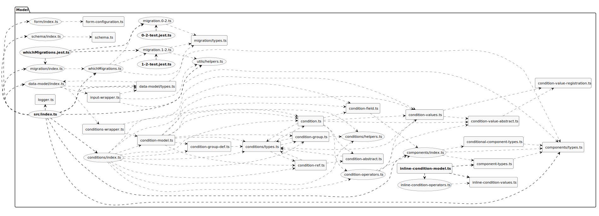

# Contributing Guide

Contributions are welcome and are greatly appreciated! Every little bit helps.

## Contents

- [Expectations](#expectations)
- [Support](#support)
- [Contributions](#contributions)
  - [Financial support](#financial-support)
  - [Improve documentation](#improve-documentation)
  - [Submit and improve issues](#submit-and-improve-issues)
  - [Slack](#slack)
  - [Code](#code)
    - [Pull requests](#pull-requests)
      - [Merging pull requests](#merging-pull-requests)
    - [Accessibility](#accessibility)
    - [Code Style Guide](#code-style-guide)
    - [Pre-commit linting](#pre-commit-linting)
    - [Application Diagrams](#application-diagrams)
      - [Component Diagram](#component-diagram)
      - [Architecture Diagrams](#architecture-diagrams)
        - [Model](#model)
        - [Designer](#designer)
        - [Runner](#runner)

## Expectations

Read our [code of conduct](./CODE_OF_CONDUCT.md) before contributing and interacting with the community.

## Support

Read [SUPPORT.md](./SUPPORT.md) for support resources and how to ask questions.

## Contributions

There are several ways you can contribute.

### Financial support

Contact [support@cautionyourblast.com](mailto:support@cautionyourblast.com) on how you can make a financial
contribution.

### Improve documentation

Documentation is always a work in progress. If you find something that is unclear, incorrect, or missing, please open an
issue or submit a pull request to improve it.

### Submit and improve issues

Help make issues easier to resolve. Some issues lack information, are not reproducible, or are just incorrect.

Using GitHub issues will also circumvent issues with disappearing slack history.

You do not need to be a maintainer to reply to issues. If an issue is of interest to you, feel free to comment on it.
This will indicate to maintainers that the issue may need prioritisation.

### Slack

Join
our [Slack workspace](https://join.slack.com/t/xgov-digital-form-bld/shared_invite/zt-xn5ltztf-3_oBzZaziV4sCpDDOGuP6Q)
to ask or answer questions.

### Code

Contribute code to fix bugs, add features, or improve the codebase. For larger changes, it is often best to first open
an issue or discussion to discuss the change before starting work on it. This helps ensure that your work aligns with
the project's goals and that there are no existing solutions or plans for the change.
You may find that there is already an existing solution that doesn't require a code change.

#### Pull requests

The [pull request template](./pull_request_template.md) is designed to help you provide all the information we need to
review your changes.
Not all sections or checkboxes need to be completed, but the more information you provide, the easier it is for us to
review your changes.

Before starting on a feature or bug, familiarise yourself with the template so you have an idea what constitutes a good
pull request.

Generally, you should include

- Tests
  - We have a suite of automated tests. Aim to add automated tests. However, you may also provide instructions for
    manual testing
  - Tests are important since several departments use this code in production. Automated tests help ensure that
    changes do not break existing functionality for another department
- An example JSON form to demonstrate your changes
- Screenshots or videos of the change
- Documentation
  - Add inline comments for hard-to-understand areas
  - Update [docs](./../docs) (and the [docs contents page](./../docs/contents.md)) if your change requires additional explanation or steps to use/configure the feature
- Include your motivations for the change

Request the XGovFormBuilder/admins team to review your pull request once ready. You can additionally ping on #general on
slack or [support@cautionyourblast.com](mailto:support@cautionyourblast.com).

##### Merging pull requests

Pull requests will be merged using
the [squash and merge](https://docs.github.com/en/github/collaborating-with-issues-and-pull-requests/about-pull-request-merges#squash-and-merge)
strategy.
This will ensure that the commit history is clean and that each pull request is represented by a single commit in the
main branch.

PR titles should be prefixed with the type of change you are making, based on
the [README.md#versioning](https://github.com/XGovFormBuilder/digital-form-builder?tab=readme-ov-file#versioning).
This is so that when performing a squash merge, the PR title is automatically used as the commit message.

Maintainers should ensure that the PR title is updated to match the type of change being made before merging.

#### Accessibility

As a minimum requirement, you must check all code that touches the front-end to ensure it is accessible
to [WCAG 2.2 AA](https://www.gov.uk/service-manual/helping-people-to-use-your-service/understanding-wcag).

Additionally, you must:

- check that automated tools such as [aXe](https://www.deque.com/axe/) pass
- ensure that users can utilise the feature with a keyboard alone
- test using one or more of
  the [common assistive technologies](https://www.gov.uk/service-manual/technology/testing-with-assistive-technologies#what-to-test)
  where possible

Your PR should detail the testing you carried out in the description.

#### Code Style Guide

We follow the [Airbnb Javascript Style Guide](https://github.com/airbnb/javascript) and have Prettier for code
formatting.

#### Pre-commit linting

Pre-commit linting is configured to run on your staged files and you can use the `--no-verify` flag with your commit
command to bypass it, please be aware that you won't be able to merge a pull request which fails the lint stage.

#### Application Diagrams

The below diagrams are in SVG format and to better visualise them just right-click and "view image" in a new tab (or
drag the file to your browser), then you'll be able to zoom in and out as you want.

#### Component Diagram

The aim of the components diagram is to identify, annotate behaviour and relationships between the most complex
components in the application. It also includes basic information about the various server's endpoints and how they
work.

To update the diagram open [Draw.io](https://app.diagrams.net/), select `Open Existing Diagram` and select the file
`./docs/components-diagram.drawio`.
When you make changes Draw.io should automatically save them to the same file, but make sure that happens, once you
finish please export a new SVG, replace `./docs/components-diagram.svg` and submit a pull request.

#### Architecture Diagrams

The architecture diagrams are automatically generated using the [Arkit](https://github.com/dyatko/arkit) open source
project.
These diagrams give us a more thorough view of all files and their respective dependencies, they are great for spotting
complex logic, circular dependencies, OO abuses, bad file naming etc.

To update these diagrams please run `yarn generate-architecture-diagrams` and submit a pull request.

##### Model

#### Designer

#### Runner

