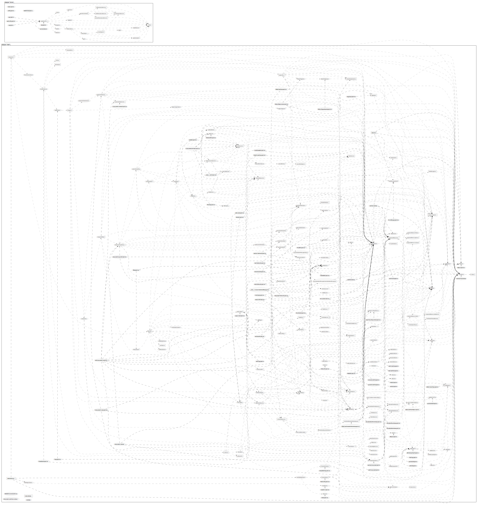
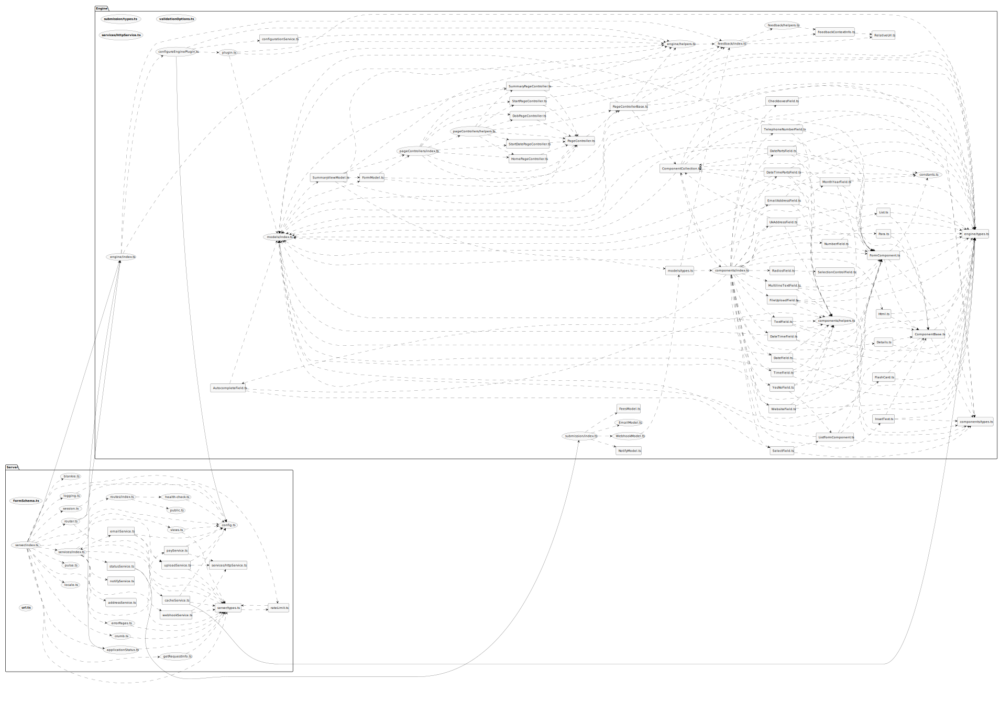

# Contributing Guide

Contributions are welcome and are greatly appreciated! Every little bit helps.

## Code of Conduct

### Our Pledge

In the interest of fostering an open and welcoming environment, we as
contributors and maintainers pledge to making participation in our project and
our community a harassment-free experience for everyone, regardless of age, body
size, disability, ethnicity, gender identity and expression, level of experience,
nationality, personal appearance, race, religion, or sexual identity and
orientation.

### Our Standards

Examples of Behaviour that contributes to creating a positive environment
include:

- Using welcoming and inclusive language
- Being respectful of differing viewpoints and experiences
- Gracefully accepting constructive criticism
- Focusing on what is best for the community
- Showing empathy towards other community members

## Setting up your environment

TODO

## Pull Request Process

TODO

## Code Style Guide

We follow the [Airbnb Javascript Style Guide](https://github.com/airbnb/javascript) and have Prettier for code formatting.

### Pre-commit linting

Pre-commit linting is configured to run on your staged files and you can use the `--no-verify` flag with your commit command to bypass it, please be aware that you won't be able to merge a pull request which fails the lint stage.

## Application Diagrams

The generated diagrams are in SVG format and to better visualise them just right-click and "view image" in a new tab (or drag the file to your browser), then you'll be able to zoom in and out as you want.

### Component Diagram

The aim of the components diagram is to identify and annotate the responsibilities and relationship between the most complex components in the application. It also includes basic information about the various server's endpoints and how they work.

To update the diagram open [Draw.io](https://app.diagrams.net/), select `Open Existing Diagram` and select the file `./docs/components-diagram.drawio`.
When you make changes Draw.io should automatically save them to the same file, but make that happens, once you finish please export a new SVG, replace `./docs/components-diagram.svg` and submit a pull request.

## Architecture Diagrams

The architecture diagrams are automatically generated using the [Arkit](https://github.com/dyatko/arkit) open source project.
These diagrams give us a more thorough view of all files and their respective dependencies, they are great for spotting complex logic, circular dependencies, OO abuses, bad file naming etc.

To update these diagrams please run `yarn generate-architecture-diagrams` and submit a pull request.

### Model

### Designer

### Runner

