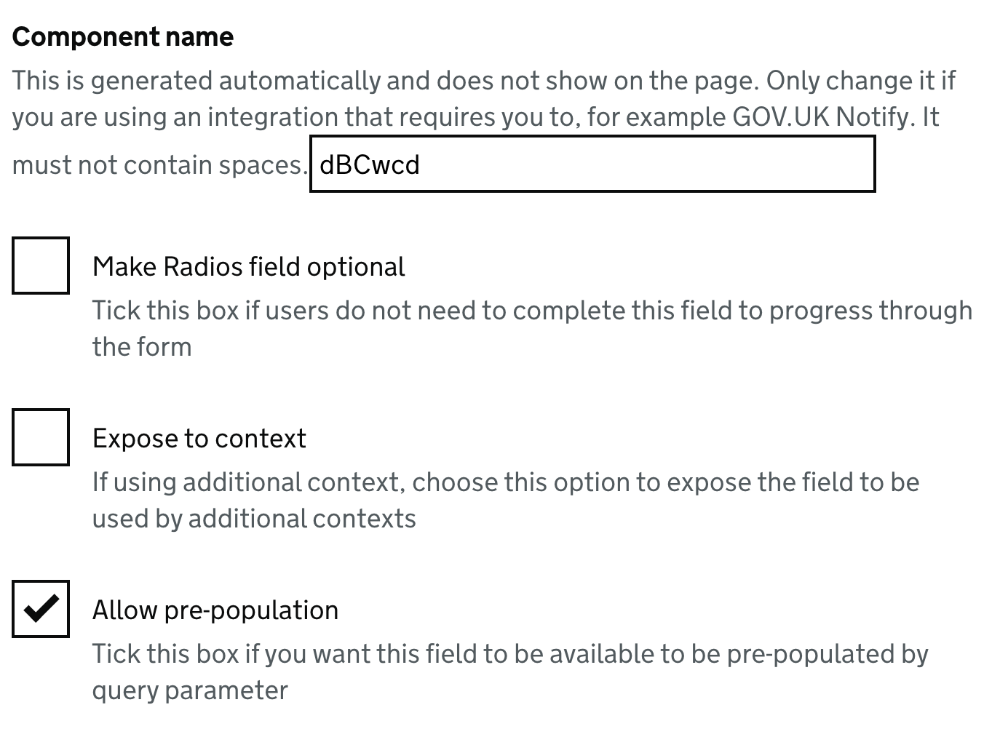

# Query parameter pre-population

In some cases users might have filled in their information on a different site before being directed through to your form. In these cases, it might be a better user experience for these bvalues to be pre-populated.

To allow this, the form builder supports query parameter pre-population, allowing values in the form to be pre-populated via query parameter.

## Setup

Access to query param pre-population is set at the component level.

To allow a field to be pre-populated, tick the "allow query parameter pre-population" checkbox on the field configuration:

Once pre-population is allowed on a field, you can pre-populate that field by appending a query parameter with the component name to a form url e.g. `https://your-forms-url/your-form/target-page?firstName=Joe&lastName=Bloggs`.

## allowPrePopulationOverwrite

By default, if a field marked for pre-population already has state set in the user's session, the incoming value will be ignored.
Sometimes you might want a query parameter to always overwrite the current state, for example, if there is a hidden field that the user will change through links with different query parameters.
To allow this, you can pass a second option to the component, `allowPrePopulationOverwrite`.

## caveats

- For the time being, due to complications with validation, this functionality is only available to list type components e.g. select fields or autocomplete fields.
- If the field is in a section, then the query param will need to be passed with dot notation e.g. `yourDetails.firstName=Joe`.
