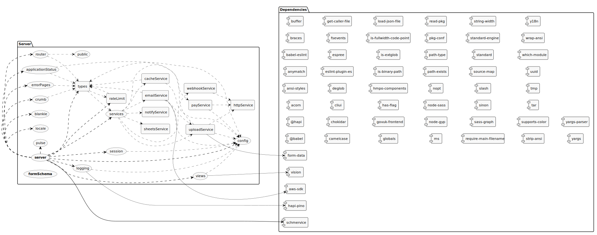
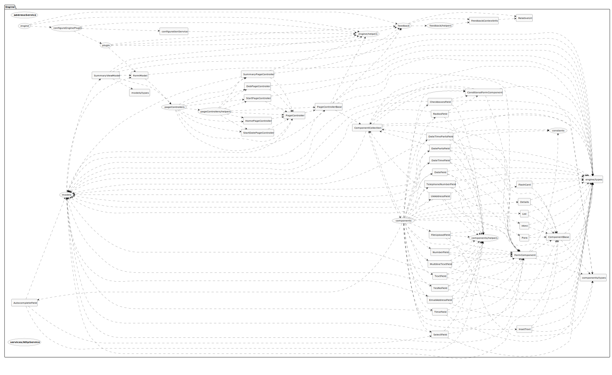

# Contributing

When contributing to this repository, please first discuss the change you wish to make via issue,
email, or any other method with the owners of this repository before making a change.

Please note we have a code of conduct, please follow it in all your interactions with the project.

## Code of Conduct

### Our Pledge

In the interest of fostering an open and welcoming environment, we as
contributors and maintainers pledge to making participation in our project and
our community a harassment-free experience for everyone, regardless of age, body
size, disability, ethnicity, gender identity and expression, level of experience,
nationality, personal appearance, race, religion, or sexual identity and
orientation.

### Our Standards

Examples of behavior that contributes to creating a positive environment
include:

- Using welcoming and inclusive language
- Being respectful of differing viewpoints and experiences
- Gracefully accepting constructive criticism
- Focusing on what is best for the community
- Showing empathy towards other community members

## Pull Request Process

TODO

## Code Style Guide

TODO

## Architecture Diagram

To update the diagram please run `yarn {workspace-name} generate-architecture-diagram`

 

